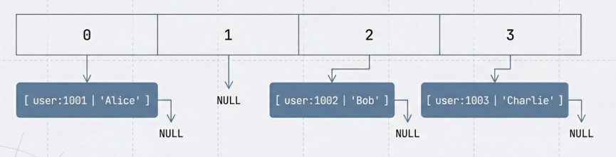

视频：
录制：redis基础3_string常见用法.mp4
日期：2026-01-30 22:44:37
录制文件：https://meeting.tencent.com/crm/2YD5r34E9f

录制：redis基础4_string的相关原理.mp4
日期：2026-01-30 22:44:28
录制文件：https://meeting.tencent.com/crm/ldypGAW094


### 1.2 String类型 - 最基础的数据类型

**学习目标**: 掌握String类型的所有操作

**学习内容**:

- SET/GET：设置和获取值
- SETEX：设置值并指定过期时间
- SETNX：仅当键不存在时设置（原子操作）
- INCR：递增操作
- 过期时间：EXPIRE、TTL

**项目对应代码**:

- `model/redismodel/token.go:16` - GET操作
- `model/redismodel/token.go:59` - SETNXEX操作（带过期时间）
- `pkg/xredis/helius_time.go:14` - INCR操作
- `pkg/oklink/client.go:186` - SETEX操作（缓存HTTP响应）

**实践任务**:

1. 实现一个简单的缓存函数（参考token.go的模式）
2. 实现一个计数器（参考helius_time.go）
3. 理解缓存穿透和缓存雪崩的概念


内容：
Q1: 掌握下基本用法


Q2: string 它在redis源码中是如何表示的（数据结构）？
0）string指的是什么？ 
指的是我们存储的数据(value)是按照string类型存储的。 
Key 始终是字符串


1）key-value数据存储到哪里？
存储在Redis 数据库的哈希表中

2）哈希表的存储方式？
数据字典中只存储key （kvobj）, value存储在Kvobj内部。 


2.1) kvobj （key-value object）
kvobj是Redis中一种特殊的对象类型，它将Key 和 value 统一存储在一个对象中。 
举例： set user:1001:name "Alice"
kvobj 内存布局：
+--------+--------+--------+------------------+------------------+
| kvobj  | hdr-   | key-SDS| value-SDS        |                  |
| (16B)  | size(1)| (7B)   | (11B)            |                  |
+--------+--------+--------+------------------+------------------+
| type=  | 1      | "user: | "Alice\0"        |                  |
| STRING |        | 1001:  |                  |                  |
| enc=   |        | name"  |                  |                  |
| EMBSTR |        |        |                  |                  |
| ptr→   |        |        |                  |                  |
+--------+--------+--------+------------------+------------------+


2.2) 存储时，key如何选定所在哈希表的槽位置？
使用哈希函数计算
步骤1： 提取key字符串
 lookupKey = kvobjGetKey(kv);  // 从 kvobj 中提取 "user:1001:name"
步骤2： 计算哈希值
```c
   hash = dictSdsHash(lookupKey);  // SipHash("user:1001:name") → 0x3A7F2B9C
   ```
步骤3：计算桶索引
 ```c
   // 假设哈希表大小为 4（2^2），mask = 0x3
   idx = 0x3A7F2B9C & 0x3 = 0
   ```

步骤4：定位到桶
   ```c
   bucket = &dict->ht_table[0][0];  // bucket[0]
   ```

---

## Q3: String 的底层实现 - SDS（Simple Dynamic String）

**String 类型的底层实现是什么？**

Redis String 类型的底层使用 **SDS（Simple Dynamic String，简单动态字符串）** 实现，而不是 C 语言原生的 `char*` 字符串。

### 1. 为什么 Redis 要自己实现 SDS？

**C 语言字符串的问题：**
```c
// C 语言字符串
char *str = "hello";
// 问题：
// 1. 获取长度需要 O(n) 遍历
// 2. 字符串拼接需要重新分配内存
// 3. 二进制不安全（不能存储 \0）
// 4. 容易缓冲区溢出
```

**SDS 的优势：**
1. **O(1) 获取长度**：头部存储长度信息
2. **二进制安全**：可以存储任意二进制数据（包括 \0）
3. **自动扩容**：拼接时自动扩展内存
4. **减少内存分配**：预分配空间，减少内存重分配
5. **兼容 C 字符串**：末尾有 \0，可以使用部分 C 字符串函数

### 2. SDS 的数据结构

**SDS 结构（简化版）：**
```c
struct sdshdr {
    size_t len;      // 字符串实际长度
    size_t alloc;    // 分配的空间大小（不包括 header 和 \0）
    unsigned char flags;  // 类型标志
    char buf[];      // 实际字符串数据（柔性数组）
};
```

**内存布局示例：**
```
SET name "Alice"

SDS 内存布局：
┌─────────┬─────────┬──────┬──────────────┬────┐
│  len=5  │ alloc=8 │flags│ "Alice\0"    │ \0 │
│ (8字节)  │ (8字节) │(1B) │ (6字节)      │(1B)│
└─────────┴─────────┴──────┴──────────────┴────┘
           ↑
           SDS 指针指向这里（buf 的起始位置）
```

### 3. SDS 的多种类型（优化）

Redis 根据字符串长度使用不同的 SDS 类型，节省内存：

| SDS 类型 | len 字段大小 | 适用场景 |
|---------|------------|---------|
| **sdshdr5** | 5位（嵌入flags） | 长度 < 32 字节 |
| **sdshdr8** | 1字节 | 长度 < 256 字节 |
| **sdshdr16** | 2字节 | 长度 < 64KB |
| **sdshdr32** | 4字节 | 长度 < 4GB |
| **sdshdr64** | 8字节 | 长度 >= 4GB |

**示例：**
```c
// 短字符串（< 32字节）
SET key "hello"  
// 使用 sdshdr5，节省内存

// 中等字符串（< 256字节）
SET key "很长的字符串..."
// 使用 sdshdr8

// 长字符串
SET key "非常非常长的字符串..."
// 使用 sdshdr16/32/64
```

### 4. String 的三种编码方式

Redis String 根据值的大小和类型，使用三种编码方式：

#### 4.1 **int** - 整数编码
```redis
SET counter 100
# 如果值是整数且在 long 范围内，直接存储为整数
# 内存：只存储整数，不需要字符串
```

#### 4.2 **embstr** - 嵌入式字符串
```redis
SET name "Alice"
# 如果字符串 <= 44 字节（Redis 7.0+），key 和 value 存储在连续内存
# 内存布局：kvobj + key-SDS + value-SDS（连续分配）
# 优势：减少内存分配次数，提高缓存局部性
```

#### 4.3 **raw** - 原始字符串
```redis
SET long_string "很长的字符串..."
# 如果字符串 > 44 字节，key 和 value 分开存储
# value 是独立的 SDS 对象
```

### 5. SDS vs C 字符串对比

| 特性 | C 字符串 | SDS |
|------|---------|-----|
| **获取长度** | O(n) 遍历 | O(1) 直接读取 len |
| **字符串拼接** | 需要手动分配内存 | 自动扩容 |
| **二进制安全** | ❌ 不能存储 \0 | ✅ 可以存储任意二进制 |
| **缓冲区溢出** | ❌ 容易溢出 | ✅ 有长度检查 |
| **内存预分配** | ❌ 每次分配 | ✅ 预分配，减少重分配 |
| **兼容性** | - | ✅ 兼容 C 字符串 API |

### 6. SDS 操作示例

**创建 SDS：**
```c
sds s = sdsnew("hello");
// 内部：分配 sdshdr + "hello\0"
// 返回：指向 buf 的指针（兼容 C 字符串）
```

**获取长度：**
```c
size_t len = sdslen(s);  // O(1)，直接读取 len 字段
// C 字符串需要：strlen(s)  // O(n)，遍历整个字符串
```

**字符串拼接：**
```c
s = sdscat(s, " world");
// 内部：
// 1. 检查是否需要扩容
// 2. 如果需要，自动扩容（预分配策略）
// 3. 追加数据
// 4. 更新 len
```

### 7. 实际存储示例

**示例 1：小字符串（embstr）**
```redis
SET user:1001:name "Alice"
```
```
内存布局：
┌─────────────────────────────────────────────┐
│ kvobj (16B)                                 │
│  type=STRING, encoding=EMBSTR              │
├─────────────────────────────────────────────┤
│ key-SDS: "user:1001:name" (sdshdr8)        │
├─────────────────────────────────────────────┤
│ value-SDS: "Alice" (sdshdr5)               │
└─────────────────────────────────────────────┘
连续内存分配，一次 malloc
```

**示例 2：大字符串（raw）**
```redis
SET long_key "很长的字符串内容..."
```
```
内存布局：
┌─────────────┐         ┌──────────────────┐
│ kvobj       │         │ value-SDS        │
│ type=STRING │  ptr───→│ (独立分配)        │
│ enc=RAW     │         │ "很长的字符串..."  │
└─────────────┘         └──────────────────┘
分开存储，两次 malloc
```

**示例 3：整数（int）**
```redis
SET counter 100
```
```
内存布局：
┌─────────────┐
│ kvobj       │
│ type=STRING │
│ enc=INT     │
│ ptr=100     │  ← 直接存储整数，不分配字符串
└─────────────┘
```

### 8. 总结

**String 底层实现的核心：**

1. **数据结构**：SDS（Simple Dynamic String）
2. **存储位置**：Redis 数据库的哈希表中（通过 key 的哈希值定位）
3. **编码方式**：int / embstr / raw（根据值的大小自动选择）
4. **优化策略**：
   - 多种 SDS 类型（sdshdr5/8/16/32/64）节省内存
   - embstr 编码减少内存分配
   - 预分配策略减少内存重分配
   - 整数编码直接存储数字

**为什么叫 String？**
- 虽然底层是 SDS，但对用户来说就是字符串类型
- 可以存储文本、数字、二进制数据
- 提供了丰富的字符串操作命令（SET/GET/APPEND/INCR 等）