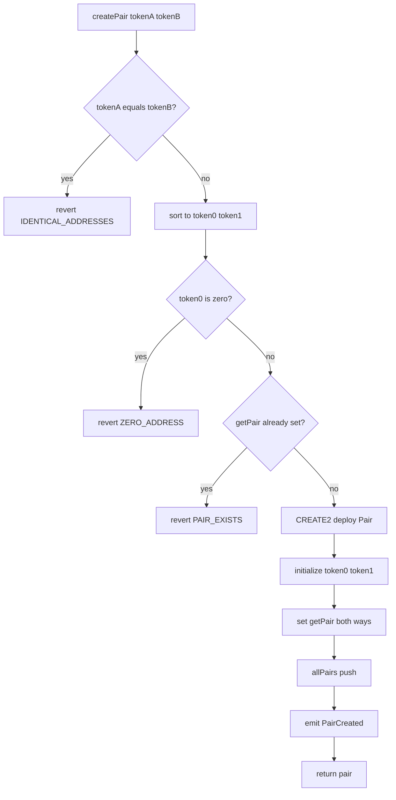

# Q1：Logic flow of `createPair` (Uniswap V2 Factory)

Below is the **order of operations** in [`UniswapV2Factory.sol`](../../contracts/UniswapV2Factory.sol) `createPair(tokenA, tokenB)`.

---

## Step-by-step

| Step | What happens | Code idea |
|------|----------------|-----------|
| **1** | Caller passes two ERC20 addresses `tokenA`, `tokenB`. | Function entry |
| **2** | **Reject identical addresses** — cannot form a pair with one token. | `require(tokenA != tokenB, 'IDENTICAL_ADDRESSES')` |
| **3** | **Sort into canonical order** — `token0` = smaller address, `token1` = larger. Order of arguments no longer matters. | `(token0, token1) = tokenA < tokenB ? ...` |
| **4** | **Reject zero address** — `token0` must be non-zero (implies both non-zero in practice for a valid pair). | `require(token0 != address(0), 'ZERO_ADDRESS')` |
| **5** | **Enforce single pool per pair** — if this `(token0, token1)` already has a Pair, revert. | `require(getPair[token0][token1] == address(0), 'PAIR_EXISTS')` |
| **6** | Load **`UniswapV2Pair` creation bytecode** (same for every pool). | `bytecode = type(UniswapV2Pair).creationCode` |
| **7** | Build **`CREATE2` salt** from the two canonical tokens only. | `salt = keccak256(abi.encodePacked(token0, token1))` |
| **8** | **Deploy** the new Pair with **`CREATE2`** — address is deterministic from Factory + salt + bytecode. | `assembly { pair := create2(...) }` |
| **9** | **Initialize** the Pair: set `token0` and `token1` in Pair storage (only Factory may call `initialize`). | `IUniswapV2Pair(pair).initialize(token0, token1)` |
| **10** | **Register** the Pair in both directions in `getPair` so lookups work for either token order. | `getPair[token0][token1] = pair; getPair[token1][token0] = pair` |
| **11** | **Append** to the global list `allPairs` (enumeration / length). | `allPairs.push(pair)` |
| **12** | **Emit** `PairCreated` with tokens, pair address, and **1-based** index `allPairs.length`. | `emit PairCreated(...)` |
| **13** | **Return** the new `pair` address to the caller. | `returns (address pair)` |

---

## Flow diagram (compact)

---

## Related

- Determinism: [2_2_deterministic_pair_deployment.md](2_2_deterministic_pair_deployment.md)  
- Factory role: [2_1_purpose.md](2_1_purpose.md)  
- [milestone2.md](milestone2.md)
