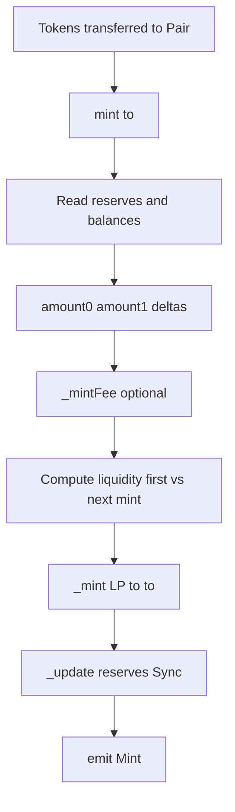

# Q1：Logic flow of adding liquidity (v2-core)

In **Uniswap V2 core**, “add liquidity” means **`UniswapV2Pair.mint(to)`**: mint **LP (ERC20)** to address **`to`** proportional to the **token0 / token1** you moved into the Pair **since the last reserves**.

There is **no** `transferFrom` inside `mint`; the usual pattern is **send tokens to the Pair first**, then **`mint`**.

---

## Off-chain / caller steps (typical)

1. Ensure a **Pair** exists (`Factory.createPair`) and **`initialize`** has set **`token0` / `token1`**.
2. **Transfer** `token0` and `token1` **to the Pair address** (exact pattern depends on whether you use a Router; core-only: `ERC20.transfer(pair, amount)` for each).
3. Call **`pair.mint(to)`** — **`to`** receives the new LP shares.

Steps 2–3 may be **one transaction** if a helper contract does both (e.g. periphery Router); the **core** contract only defines **`mint`**.

---

## On-chain: what `mint` does (order inside the function)

```110:131:contracts/UniswapV2Pair.sol
    function mint(address to) external lock returns (uint liquidity) {
        (uint112 _reserve0, uint112 _reserve1,) = getReserves(); // gas savings
        uint balance0 = IERC20(token0).balanceOf(address(this));
        uint balance1 = IERC20(token1).balanceOf(address(this));
        uint amount0 = balance0.sub(_reserve0);
        uint amount1 = balance1.sub(_reserve1);

        bool feeOn = _mintFee(_reserve0, _reserve1);
        uint _totalSupply = totalSupply; // gas savings, must be defined here since totalSupply can update in _mintFee
        if (_totalSupply == 0) {
            liquidity = Math.sqrt(amount0.mul(amount1)).sub(MINIMUM_LIQUIDITY);
           _mint(address(0), MINIMUM_LIQUIDITY); // permanently lock the first MINIMUM_LIQUIDITY tokens
        } else {
            liquidity = Math.min(amount0.mul(_totalSupply) / _reserve0, amount1.mul(_totalSupply) / _reserve1);
        }
        require(liquidity > 0, 'UniswapV2: INSUFFICIENT_LIQUIDITY_MINTED');
        _mint(to, liquidity);

        _update(balance0, balance1, _reserve0, _reserve1);
        if (feeOn) kLast = uint(reserve0).mul(reserve1); // reserve0 and reserve1 are up-to-date
        emit Mint(msg.sender, amount0, amount1);
    }
```

| Step | Meaning |
|------|--------|
| **`lock`** | Reentrancy guard for the whole call. |
| **`getReserves()`** | Last persisted **`reserve0` / `reserve1`**. |
| **`balanceOf(address(this))`** | Current ERC20 balances of the Pair (includes what you just transferred). |
| **`amount0` / `amount1`** | **Increments** since last reserves: `balance - reserve` (the “deposits” for this mint). |
| **`_mintFee`** | If protocol fee is on, may mint LP to **`feeTo`** before your LP (updates **`totalSupply`** in edge cases). |
| **First mint** (`totalSupply == 0`) | `liquidity = sqrt(amount0 * amount1) - MINIMUM_LIQUIDITY`; **`MINIMUM_LIQUIDITY`** LP sent to **`address(0)`** (permanent lock). |
| **Later mints** | `liquidity = min(amount0/reserve0, amount1/reserve1)` in “share” form: `min(amount0 * T / R0, amount1 * T / R1)`. |
| **`require(liquidity > 0)`** | Otherwise **`INSUFFICIENT_LIQUIDITY_MINTED`**. |
| **`_mint(to, liquidity)`** | ERC20 mint LP to **`to`**. |
| **`_update`** | Writes new **`reserve0` / `reserve1`** from balances; updates TWAP accumulators when time elapses; **`emit Sync`**. |
| **`kLast`** | If fee switch on, stores \(k\) after liquidity event for protocol fee accounting. |
| **`emit Mint`** | Logs **`amount0` / `amount1`** actually used for this mint. |

---

## Flow diagram



---

## Related

- Script: [add-liquidity.js](../../scripts/add-liquidity.js) — `yarn add:liquidity`  
- [milestone3.md](milestone3.md)
