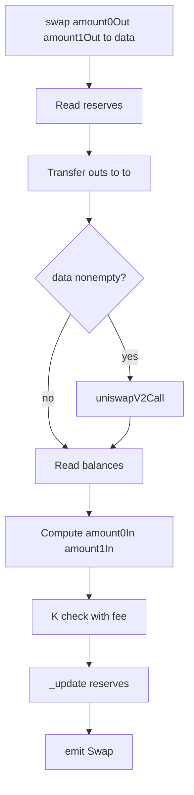

# Q1：Swap logic flow (`UniswapV2Pair.swap`)

**`swap(amount0Out, amount1Out, to, data)`** is the core trade function. It **sends output tokens out first** (“optimistic”), then **requires** enough **input** to have landed in the Pair so the **constant product with 0.3% fee** still holds.

---

## Preconditions (early `require`s)

| Check | Meaning |
|--------|--------|
| `amount0Out > 0 \|\| amount1Out > 0` | Must request some output. |
| `amount0Out < reserve0 && amount1Out < reserve1` | Cannot withdraw more than **current reserves** (strict `<`). |
| `to != token0 && to != token1` | **`INVALID_TO`** — recipient cannot be a pool token contract (avoids weird reentrancy / transfer edge cases). |

---

## Step-by-step (same order as the code)

```159:187:contracts/UniswapV2Pair.sol
    function swap(uint amount0Out, uint amount1Out, address to, bytes calldata data) external lock {
        require(amount0Out > 0 || amount1Out > 0, 'UniswapV2: INSUFFICIENT_OUTPUT_AMOUNT');
        (uint112 _reserve0, uint112 _reserve1,) = getReserves(); // gas savings
        require(amount0Out < _reserve0 && amount1Out < _reserve1, 'UniswapV2: INSUFFICIENT_LIQUIDITY');
        ...
        if (amount0Out > 0) _safeTransfer(_token0, to, amount0Out); // optimistically transfer tokens
        if (amount1Out > 0) _safeTransfer(_token1, to, amount1Out); // optimistically transfer tokens
        if (data.length > 0) IUniswapV2Callee(to).uniswapV2Call(msg.sender, amount0Out, amount1Out, data);
        balance0 = IERC20(_token0).balanceOf(address(this));
        balance1 = IERC20(_token1).balanceOf(address(this));
        ...
        uint amount0In = balance0 > _reserve0 - amount0Out ? balance0 - (_reserve0 - amount0Out) : 0;
        uint amount1In = balance1 > _reserve1 - amount1Out ? balance1 - (_reserve1 - amount1Out) : 0;
        require(amount0In > 0 || amount1In > 0, 'UniswapV2: INSUFFICIENT_INPUT_AMOUNT');
        ...
        require(balance0Adjusted.mul(balance1Adjusted) >= uint(_reserve0).mul(_reserve1).mul(1000**2), 'UniswapV2: K');
        ...
        _update(balance0, balance1, _reserve0, _reserve1);
        emit Swap(msg.sender, amount0In, amount1In, amount0Out, amount1Out, to);
    }
```

| Step | What happens |
|------|----------------|
| **1. `lock`** | Reentrancy guard (modifier on function). |
| **2. Read reserves** | `_reserve0`, `_reserve1` = last persisted pool state. |
| **3. Optimistic out** | `_safeTransfer` **token0** and/or **token1** to **`to`** per `amount0Out` / `amount1Out`. |
| **4. Flash path** | If **`data.length > 0`**, call **`to.uniswapV2Call(...)`** so a contract can borrow and **return** tokens in the same tx (flash swap). |
| **5. Read balances** | `balance0`, `balance1` = Pair’s ERC20 balances **after** out-transfers (and after callback if any). |
| **6. Infer inputs** | `amount0In` / `amount1In` = how much **extra** token0/token1 the pool holds vs “reserves minus what we sent out” — i.e. what came **in** as payment for the swap. |
| **7. Input must exist** | At least one of `amount0In`, `amount1In` must be **> 0** (`INSUFFICIENT_INPUT_AMOUNT`). |
| **8. K check (fee)** | `balance0Adjusted * balance1Adjusted >= reserve0 * reserve1 * 1000²` with **`amount*In * 3`** folded into “adjusted” balances — encodes **0.3%** fee to LPs. |
| **9. `_update`** | Persist new reserves + TWAP accumulators; **`emit Sync`** inside `_update`. |
| **10. `emit Swap`** | Log inferred inputs/outputs for indexers. |

---

## Intuition

- **Outputs** are fixed by the caller (`amount0Out`, `amount1Out`).
- **Inputs** are whatever actually arrived at the Pair by the time balances are read (including **before** this call if you transferred in first, or **during** `uniswapV2Call` for flash swaps).
- The **`K`** inequality ensures the trade **pays** at least the **AMM fee** relative to pre-swap reserves.

---

## Flow diagram



---

## Related

- Script: [swap-exact-in.js](../../scripts/swap-exact-in.js) — `yarn swap`  
- [milestone4.md](milestone4.md)
