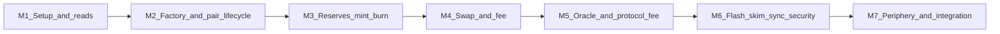

# Uniswap V2 core concepts and learning roadmap

A catalog of **v2-core** concepts (this repo’s [contracts](../../contracts/)) plus a step-by-step milestone path. Optional hands-on steps use the yarn scripts in [package.json](../../package.json).

## Scope

- **In scope:** Factory, Pair, LP ERC20, libraries, and interfaces under [`contracts/`](../../contracts/). See also [Core features](../1.environment/4.core_features_of_this_contract.md).
- **Outside this repo (full V2):** Uniswap V2 **Router / Periphery** (multi-hop, WETH, deadlines, ergonomic `addLiquidity`). Covered in Milestone 7 as “read next”; not required to understand core Solidity here.

---

## Concept inventory

### A. AMM economics and math

| Concept | Where |
|--------|--------|
| Constant product \(x \cdot y = k\) | [`UniswapV2Pair.sol`](../../contracts/UniswapV2Pair.sol) — `swap` K check |
| Reserves vs ERC20 balances | `_update`; balances can differ (donations, `skim` / `sync`) |
| 0.3% swap fee | `balance{0,1}Adjusted` and `amount{0,1}In.mul(3)` in `swap` |
| Liquidity as shares | LP `totalSupply` + `mint` / `burn` pro-rata math |
| First mint / `MINIMUM_LIQUIDITY` | `mint` when `_totalSupply == 0`; locked to `address(0)` |
| Protocol fee on growth | `_mintFee` when `factory.feeTo() != 0` and `kLast` |

### B. Factory layer

| Concept | Where |
|--------|--------|
| Deterministic pair deployment | `create2` + `keccak256(abi.encodePacked(token0, token1))` salt |
| `token0` / `token1` ordering | `tokenA < tokenB` in [`UniswapV2Factory.sol`](../../contracts/UniswapV2Factory.sol) |
| Registry | `getPair`, `allPairs`, `PairCreated` |
| Governance | `feeTo`, `feeToSetter`, `setFeeTo`, `setFeeToSetter` |
| One-time pair init | `initialize(token0, token1)` inside `createPair` |

### C. Pair: liquidity

| Concept | Where |
|--------|--------|
| Transfer then mint | `mint` — increments = `balance - reserve` |
| Add liquidity | `mint(to)` |
| Remove liquidity | `burn(to)` (LP usually sent to pair first; Router wraps the flow) |

### D. Pair: trading

| Concept | Where |
|--------|--------|
| Optimistic output | `_safeTransfer` out before full input is enforced |
| K invariant with fee | Post-swap balance check in `swap` |
| Flash swap | `data.length > 0` → [`IUniswapV2Callee`](../../contracts/interfaces/IUniswapV2Callee.sol) |
| `INVALID_TO` | `to` cannot be `token0` or `token1` |

### E. Oracle / TWAP

| Concept | Where |
|--------|--------|
| Time-weighted cumulative price | `price0CumulativeLast`, `price1CumulativeLast` |
| Fixed-point math | [`UQ112x112.sol`](../../contracts/libraries/UQ112x112.sol) |
| Per-block update | `_update` + `blockTimestampLast` |

### F. Safety and hygiene

| Concept | Where |
|--------|--------|
| Reentrancy guard | `lock` modifier |
| Safe ERC20 transfer | `_safeTransfer` |
| `skim` / `sync` | Reconcile stray balance vs reserves |

### G. LP token (ERC20 + Permit)

| Concept | Where |
|--------|--------|
| LP as ERC20 | [`UniswapV2ERC20.sol`](../../contracts/UniswapV2ERC20.sol) |
| Permit (EIP-2612 style) | `permit`, `DOMAIN_SEPARATOR`, `nonces` |

### H. Supporting libraries

| Concept | Where |
|--------|--------|
| Overflow-safe arithmetic | [`SafeMath.sol`](../../contracts/libraries/SafeMath.sol) |
| `sqrt` for liquidity | [`Math.sol`](../../contracts/libraries/Math.sol) |

---

## Learning roadmap (milestones)

Detail pages (concepts per milestone): [Milestone 1](milestone1.md) · [2](milestone2.md) · [3](milestone3.md) · [4](milestone4.md) · [5](milestone5.md) · [6](milestone6.md) · [7](milestone7.md).

Read the cited contracts, then optionally run commands from [Yarn scripts](#yarn-scripts-hands-on).

### Milestone 1 — Setup and how to read the code

- **Learn:** Repo layout, compile/test, what “core” excludes (Router).
- **Do:** [Environment](../1.environment/1.environment.md), [Build](../1.environment/2.how_to_build_the_contract.md), skim [Core features](../1.environment/4.core_features_of_this_contract.md).

### Milestone 2 — Factory and pair lifecycle

- **Learn:** `createPair`, CREATE2, `token0` / `token1`, `initialize`, `getPair`.
- **Read:** [`UniswapV2Factory.sol`](../../contracts/UniswapV2Factory.sol), Pair `constructor` / `initialize`.
- **Do (optional):** `yarn deploy`, `yarn createpair` — [test createPair](../1.environment/5.test_createPair.md).

### Milestone 3 — Reserves, balances, mint, burn

- **Learn:** `getReserves`, `_update`, why `mint` uses balance deltas; `MINIMUM_LIQUIDITY`; burn math (high level).
- **Read:** `mint`, `burn`, `_update` in [`UniswapV2Pair.sol`](../../contracts/UniswapV2Pair.sol); [`Math.sol`](../../contracts/libraries/Math.sol) for `sqrt`.
- **Do (optional):** `yarn check:liquidity`, `yarn add:liquidity` — [Add liquidity](../1.environment/6.add_liquidity.md).

### Milestone 4 — Swap and the 0.3% fee

- **Learn:** Optimistic transfers, `amount0In` / `amount1In`, K check; off-chain `getAmountOut` (997/1000).
- **Read:** Full `swap` in Pair.
- **Do (optional):** [Swap](../1.environment/7.swap.md), `yarn swap`.

### Milestone 5 — TWAP and protocol fee

- **Learn:** Cumulative prices; `_mintFee`, `kLast`, `feeTo`.
- **Read:** `_update` (TWAP branch), `_mintFee`, `kLast` updates in `mint` / `burn` / `swap`; [`UQ112x112.sol`](../../contracts/libraries/UQ112x112.sol).

### Milestone 6 — Flash swap, skim, sync, reentrancy

- **Learn:** Flash callback flow; `skim` / `sync`; `lock`.
- **Read:** `swap` callback path; `skim` / `sync`; `lock` on Pair.

### Milestone 7 — LP token + periphery (outside this repo)

- **Learn:** `UniswapV2ERC20` + `permit`; then V2 **Periphery** / `UniswapV2Router02` (atomic UX, paths, deadlines).
- **Read:** [`UniswapV2ERC20.sol`](../../contracts/UniswapV2ERC20.sol); external router source or docs.

---

## Yarn scripts (hands-on)

Defined in [package.json](../../package.json):

| Command | Purpose |
|---------|---------|
| `yarn compile` | Build artifacts under `build/` |
| `yarn deploy` | Deploy Factory |
| `yarn deploy:tokens` | Deploy two test ERC20s |
| `yarn createpair` | `Factory.createPair` |
| `yarn check:liquidity` | Read pair reserves / LP supply (no key) |
| `yarn add:liquidity` | Transfer tokens + `mint` |
| `yarn swap` | Exact-in swap (transfer + `swap`) |

Requires `.env` as described in the linked `questions/1.environment` notes.
